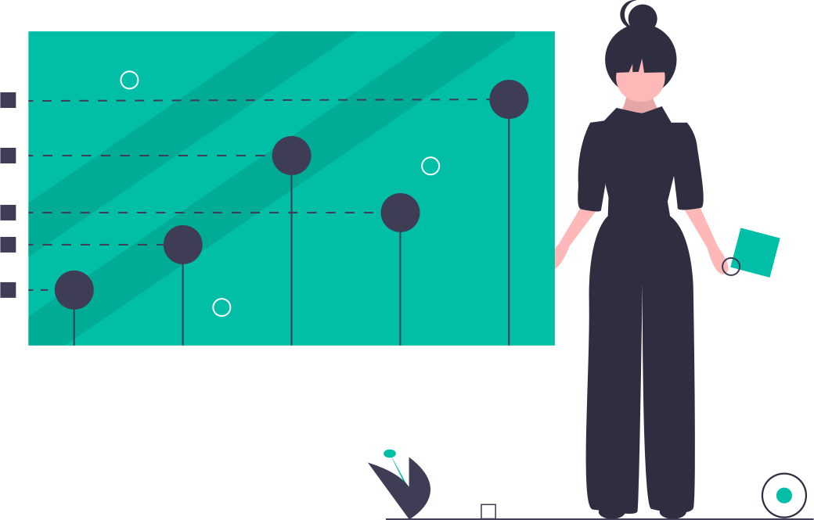

# Table Of Contents

> **◼️ Users ▸** These are notes captured during secondary research for my Data Ethics learning journey in 2021. My intent is to help others by sharing my notes for personal self-study only. Please do not replicate or repurpose without asking. **◼️ Authors ▸** If I cited your content or my notes inaccurately reflect your intent,  please DM me [@nitya](https:twitter.com/nitya) with requests for remove or modifications and I will take action to correct it.

## Scope

| My Initial Roadmap: See [Notes](/notes/0-roadmap) for interactive version|
|:--:|

---

 1. [Motivation](notes/1-motivation.md) 
 2. [Ethics Definitions](notes/2-concepts.md)
 3. [Ethics Challenges](notes/3-challenges.md)
 4. [Harms & Consequences](notes/4-consequences.md)
 5. [Case Studies](notes/5-casestudies.md)
 6. [Applied Ethics](notes/6-applied.md)
 7. [Summary](notes/7-culture.md)
 8. [References](references/README.md)
 9. [Roadmap](notes/0-roadmap.md)

| _Image Credit: undraw.co_ | 
|:---:|
|  |

---

---

---

